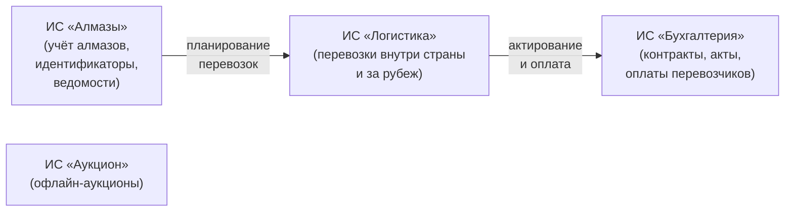
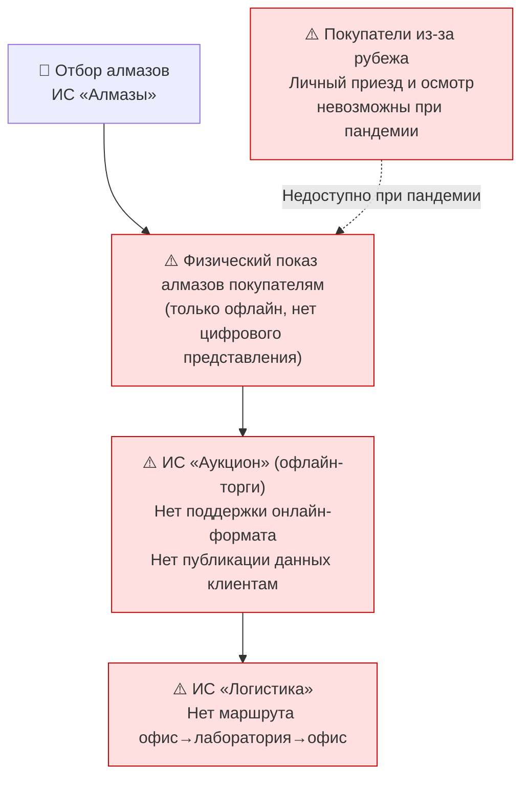
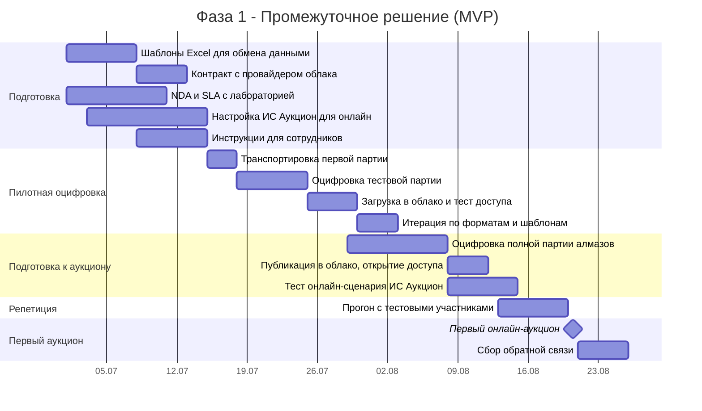
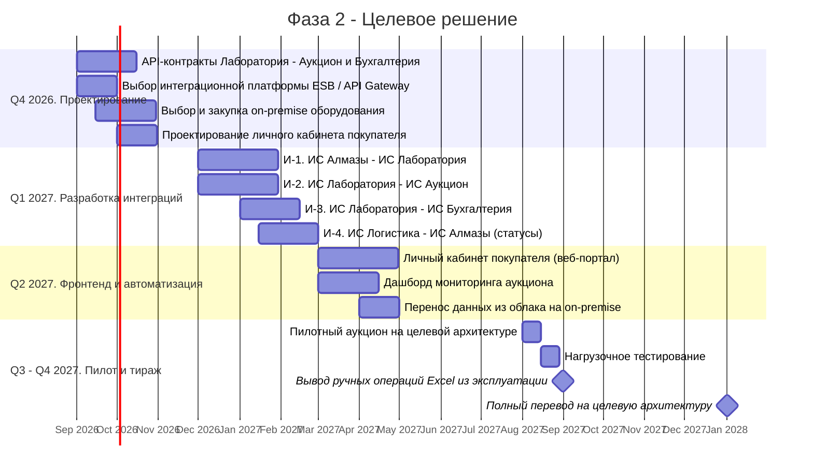
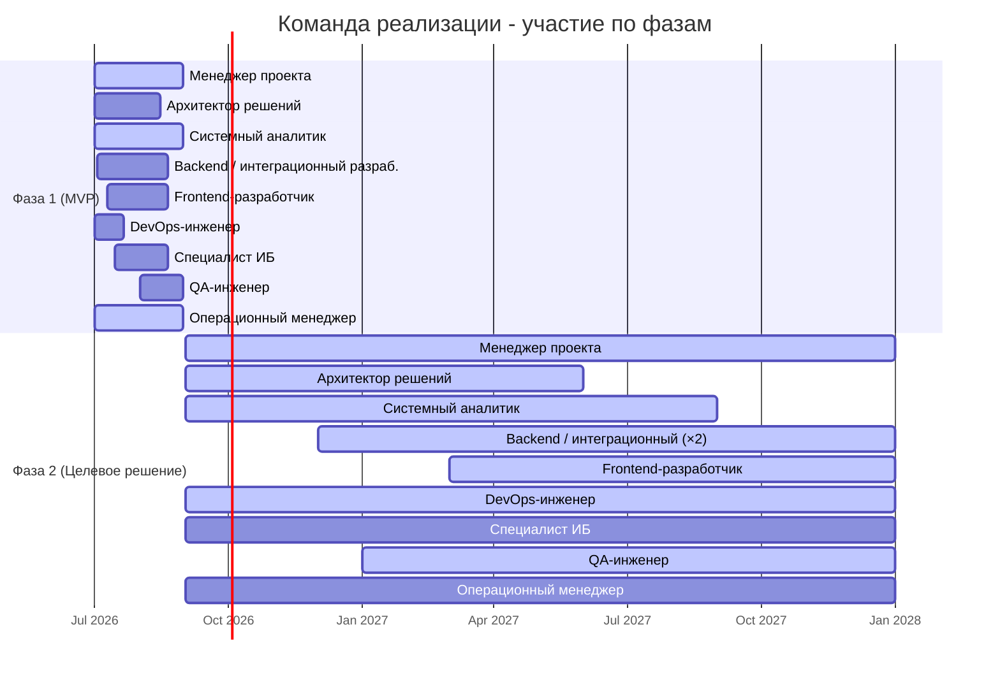

# Архитектурное видение: Цифровая платформа продажи алмазов
## Diamond Universe - Online Diamond Auction Platform

**Версия:** 1.0  
**Статус:** На согласовании  
**Автор:** Андрей Лесников

---

## Резюме

### Задача

Компания Diamond Universe проводит аукционы по продаже природных алмазов исключительно в офлайн-формате. В условиях пандемии COVID-19 и трансформации рынка это привело к потере доли продаж: необработанные алмазы — минус 33%, поставки на огранку — минус ~50%. Международные покупатели из ключевых торговых центров (Индия, Китай, Бельгия) не могут лично присутствовать на торгах, а существующая ИТ-инфраструктура не поддерживает онлайн-аукционы и цифровое представление алмазов. Решение создаёт цифровой канал продаж, сохраняет конкурентоспособность и открывает рынок для удалённых покупателей.

### Контекст

Задача возникла именно сейчас, потому что пандемия 2020 года необратимо изменила ожидания покупателей: возврат к исключительно офлайн-формату означает устойчивую потерю клиентов. Одновременно методы 3D-сканирования и спектрального анализа алмазов достигли зрелости, при которой цифровое описание заменяет личный осмотр. Текущее состояние: четыре ИС («Алмазы», «Аукцион», «Логистика», «Бухгалтерия») автоматизируют офлайн-процессы, но не связаны с внешней лабораторией и не поддерживают онлайн-торги. Ключевые ограничения: первый онлайн-аукцион необходимо провести через **2 месяца** — срок, исключающий капитальную переработку систем; существующие ИС должны быть сохранены; новая ИС «Лаборатория» находится у внешнего подрядчика.

### Описание оптимального решения

Реализуется в двух фазах. **Фаза 1 (2 месяца, промежуточное решение):** обмен данными с лабораторией через Excel по утверждённым шаблонам, публикация данных о лотах в частном облаке, минимальная адаптация ИС «Аукцион» для онлайн-формата — без существенных доработок ИС. **Фаза 2 (16 месяцев, целевое решение):** полная автоматизация через API-интеграции между всеми ИС, личный кабинет покупателя, KYC-онбординг, платёжный модуль, перенос критичных сервисов на собственную инфраструктуру. Для реализации потребуются команда ~12 человек, внешняя лаборатория как API-партнёр и облачный провайдер на переходный период. Общий бюджет проекта: ~65–112 млн ₽.

---

## Содержание

1. [Введение](#1-введение)
   - 1.1 [Цель документа](#11-цель-документа)
   - 1.2 [Область применения](#12-область-применения)
   - 1.3 [Глоссарий](#13-глоссарий)
2. [Бизнес-контекст и цели](#2-бизнес-контекст-и-цели)
   - 2.1 [Бизнес-цели](#21-бизнес-цели)
   - 2.2 [Ключевые стейкхолдеры](#22-ключевые-стейкхолдеры)
   - 2.3 [Стратегические драйверы](#23-стратегические-драйверы)
3. [Описание текущего состояния](#3-описание-текущего-состояния)
   - 3.1 [Обзор текущей ИТ-инфраструктуры](#31-обзор-текущей-ит-инфраструктуры)
   - 3.2 [Болевые точки](#32-болевые-точки)
4. [Целевое состояние](#4-целевое-состояние)
   - 4.1 [Концептуальная схема решения](#41-концептуальная-схема-решения)
   - 4.2 [Описание ключевых компонентов](#42-описание-ключевых-компонентов)
5. [Архитектурные принципы и ограничения](#5-архитектурные-принципы-и-ограничения)
   - 5.1 [Основные принципы](#51-основные-принципы)
   - 5.2 [Технические ограничения](#52-технические-ограничения)
   - 5.3 [Стандарты разработки](#53-стандарты-разработки)
6. [Нефункциональные требования](#6-нефункциональные-требования)
   - 6.1 [Производительность](#61-производительность)
   - 6.2 [Масштабируемость](#62-масштабируемость)
   - 6.3 [Доступность (SLA)](#63-доступность-sla)
   - 6.4 [Безопасность](#64-безопасность)
   - 6.5 [Прочие нефункциональные требования](#65-прочие-нефункциональные-требования)
7. [Дорожная карта реализации](#7-дорожная-карта-реализации)
   - 7.1 [Фаза 1 - Промежуточное решение (MVP)](#71-фаза-1--промежуточное-решение-mvp)
   - 7.2 [Фаза 2 - Целевое решение](#72-фаза-2--целевое-решение)
   - 7.3 [Команда и ресурсы](#73-команда-и-ресурсы)
   - 7.4 [Укрупнённая бюджетная оценка](#74-укрупнённая-бюджетная-оценка)
8. [Риски и допущения](#8-риски-и-допущения)
   - 8.1 [Технические риски](#81-технические-риски)
   - 8.2 [Бизнес- и регуляторные риски](#82-бизнес--и-регуляторные-риски)
   - 8.3 [Допущения](#83-допущения)

---

## 1. Введение

### 1.1 Задача

**Проблема.** Компания Diamond Universe проводит аукционы по продаже природных алмазов исключительно в офлайн-формате: покупатели обязаны лично присутствовать на торгах и осматривать алмазы. В условиях пандемии COVID-19 и последующей трансформации рынка такой формат оказался менее привлекательным - международные покупатели из ключевых торговых центров предпочитают участвовать в онлайн-аукционах. При этом существующая ИТ-инфраструктура не поддерживает онлайн-торги, публикацию цифровых описаний алмазов, логистический маршрут «офис → лаборатория → офис» и необходимые интеграции между информационными системами.

**Кому помогает решение и чем.** Платформа Diamond Universe решает эту проблему для трёх групп участников:

- **Покупатели алмазов** получают возможность участвовать в торгах удалённо, не выезжая из своей страны: вместо личного осмотра каждый лот будет представлен полным цифровым описанием (3D-модель, изображения высокого разрешения, метрики 4C), обеспечивающим качество информации, сопоставимое с физическим осмотром.
- **Операционная команда компании** избавляется от ручных операций и дублирующего ввода данных: автоматизированный обмен данными между ИС «Алмазы», ИС «Лаборатория», ИС «Аукцион», ИС «Логистика» и ИС «Бухгалтерия» сокращает время подготовки аукциона и снижает операционные риски.
- **Бизнес в целом** открывает новый цифровой канал продаж, расширяет географию покупателей и снижает зависимость от присутствия конкретных людей и внешних облачных сервисов.

**Почему это важно.** Отсутствие цифрового канала продаж уже привело к потере доли рынка: в 2020 году продажи необработанных алмазов снизились примерно на 33%, а поставки на огранку - почти вдвое. Компании, первыми перешедшие в онлайн, получили стратегическое преимущество, которое с каждым годом только закрепляется. Кроме того, крупнейшие международные покупатели привыкли к удалённым сделкам, и возврат к исключительно офлайн-формату означает безвозвратную потерю этих клиентов. Решение задачи позволяет сохранить конкурентоспособность, восстановить выручку и создать масштабируемую платформу, готовую к росту числа аукционов и ужесточению регуляторных требований в сфере цифровой идентификации и отслеживаемости цепочки хранения алмазов.

### 1.2 Область применения

Документ охватывает:

| Область | Описание |
|---------|----------|
| **Процессы** | Полный цикл подготовки и проведения онлайн-аукциона: отбор алмазов → транспортировка → оцифровка → публикация → аукцион → доставка победителям |
| **Информационные системы** | ИС «Алмазы», ИС «Аукцион», ИС «Логистика», ИС «Бухгалтерия», ИС «Лаборатория» (новая), облачные сервисы |
| **Организационные единицы** | Центральный офис, внешняя лаборатория, специальный перевозчик |
| **Интеграции** | Все интерфейсы между перечисленными системами, включая новые |

### 1.3 Глоссарий

| Термин | Определение |
|--------|-------------|
| **Ювелирный алмаз** | Алмаз достаточного размера и прозрачности для изготовления бриллиантов в ювелирных изделиях; учитывается индивидуально с присвоением уникального идентификатора. |
| **Оцифровка алмаза** | Процесс получения цифрового описания алмаза: трёхмерная модель, метрики качества (4C: каратность, цвет, чистота, огранка), данные о флуоресценции, внутренних напряжениях, трещинах, включениях. |
| **Онлайн-аукцион** | Торги по продаже алмазов, проводимые в цифровом формате без физического присутствия покупателей. |
| **Лот** | Один или несколько алмазов, выставленных на продажу как единица торгов. |
| **ИС «Алмазы»** | Информационная система учёта драгоценных алмазов; ведёт реестр алмазов, планирует работы, присваивает идентификаторы. |
| **ИС «Аукцион»** | Информационная система проведения аукционов (исторически - офлайн); в целевом состоянии поддерживает онлайн-торги и публикацию данных для клиентов. |
| **ИС «Логистика»** | Информационная система управления перевозками алмазов внутри страны и за рубеж. |
| **ИС «Бухгалтерия»** | Информационная система финансового учёта: контракты, акты, оплаты. |
| **ИС «Лаборатория»** | Новая информационная система, расположенная у внешнего подрядчика; формирует цифровые описания алмазов по результатам инструментального анализа. |
| **MVP** | Minimum Viable Product - минимально жизнеспособный продукт; первая рабочая версия, обеспечивающая базовую функциональность. |
| **Промежуточное решение** | Архитектура на базе существующих систем и ручных операций (Excel, облако), позволяющая провести первый аукцион без существенных доработок ИС. |
| **Целевое решение** | Полностью автоматизированная архитектура с интеграциями между всеми ИС, без ручных операций и Excel. |
| **4C** | Международная система оценки алмазов: Carat (каратность), Color (цвет), Clarity (чистота), Cut (огранка). |

---

## 2. Бизнес-контекст и цели

### 2.1 Бизнес-цели

Инициатива направлена на достижение следующих бизнес-целей:

| # | Бизнес-цель | Измеримый результат |
|---|-------------|---------------------|
| БЦ-1 | **Открыть цифровой канал продаж** - обеспечить возможность покупки алмазов без физического присутствия покупателя | Первый онлайн-аукцион проведён **через 2 месяца** с момента старта проекта |
| БЦ-2 | **Расширить географию покупателей** - привлечь клиентов из Индии, Китая, Бельгии и других ключевых центров торговли без обязательных командировок | Рост числа уникальных участников аукционов на **30%** в течение первого года |
| БЦ-3 | **Снизить операционные издержки** на организацию торгов за счёт устранения ручных операций и дублирующего ввода данных | Сокращение времени подготовки аукциона на **40%** в целевом состоянии |
| БЦ-4 | **Повысить качество представления алмазов** - обеспечить покупателям данные об алмазе, эквивалентные или превосходящие личный осмотр | Удовлетворённость покупателей качеством данных ≥ **4.0/5.0** по результатам опросов |
| БЦ-5 | **Снизить зависимость от внешних сервисов** - перенести критичные функции на собственную инфраструктуру | В целевом состоянии: доля критичных функций на собственных серверах ≥ **80%** |
| БЦ-6 | **Обеспечить прозрачность и отслеживаемость** процесса подготовки аукциона для операционного контроля | Единый дашборд с актуальным статусом всех лотов и этапов подготовки |

### 2.2 Ключевые стейкхолдеры

| Стейкхолдер | Роль | Интересы и ожидания |
|-------------|------|---------------------|
| **Генеральный директор** | Спонсор инициативы | Сохранение конкурентоспособности, рост выручки, быстрый выход на рынок |
| **Коммерческий директор** | Владелец бизнес-процесса продаж | Привлечение новых покупателей, прозрачность аукционных данных, удобство для клиентов |
| **Операционный директор** | Владелец процессов логистики и подготовки аукционов | Надёжность логистики, контроль над статусом алмазов, минимизация ручного труда |
| **ИТ-директор (CIO)** | Технический куратор | Интеграция с существующими ИС, соответствие стандартам ИБ, управляемость архитектуры |
| **Финансовый директор** | Контроль затрат | Прозрачность расходов на лабораторию и перевозчиков, соблюдение бюджета |
| **Руководитель лаборатории** (внешний партнёр) | Поставщик услуг оцифровки | Чёткие требования к форматам данных, удобный API, своевременная оплата |
| **Перевозчик** (внешний партнёр) | Поставщик услуг транспортировки | Корректные заявки на перевозку, автоматическое актирование |
| **Покупатели алмазов** | Конечные пользователи платформы | Высокое качество данных о алмазах, удобный интерфейс, надёжность аукционной платформы, конфиденциальность |

### 2.3 Стратегические драйверы

#### 2.3.1 Внешние драйверы

**Пандемия COVID-19 и посткризисная трансформация.**  
В 2020 году глобальные продажи ювелирных изделий с бриллиантами снизились на ~15%, необработанных алмазов - на ~33%, поставки на огранку - почти вдвое. Переход в онлайн стал условием выживания. Компании, первыми освоившие цифровые каналы, получили стратегическое преимущество.

**Изменение ожиданий покупателей.**  
Крупнейшие покупатели из Индии, Китая и Бельгии привыкли к удалённым сделкам. Возврат к исключительно офлайн-формату уже невозможен без потери доли рынка.

**Технологическая зрелость.**  
Методы трёхмерного сканирования и спектрального анализа алмазов достигли уровня, при котором цифровое описание алмаза может заменить личный осмотр для большинства решений о покупке.

#### 2.3.2 Регуляторные факторы и риски

> ⚠️ **Важно:** Регуляторная среда в сфере торговли природными алмазами нестабильна. Требования к ведению онлайн-торговли высокоценными активами продолжают ужесточаться, что непосредственно влияет на архитектуру платформы и план реализации.

**Контекст: существующее соответствие требованиям.**
Компания уже выполняет базовые отраслевые требования: сертификация происхождения алмазов по **Процессу Кимберли (KPCS), экспортная документация, а также процедуры KYC/AML при регистрации покупателей**.

Переход в онлайн **не отменяет** эти требования, но **порождает новые архитектурные задачи**:

- Идентификация покупателей должна выполняться удалённо, без личного присутствия.
- Цифровой канал должен обеспечивать прослеживаемость цепочки хранения (Chain of Custody) в соответствии с требованиями к онлайн-торговле ценными активами.

**Регуляторный риск.** Требования к дистанционной верификации участников торгов продолжают ужесточаться. Архитектура должна позволять адаптировать процедуры верификации без переработки смежных систем.

---

## 3. Описание текущего состояния

### 3.1 Обзор текущей ИТ-инфраструктуры

На момент старта инициативы компания располагает следующими информационными системами:

**Характеристики существующих систем:**

| ИС | Назначение | Режим работы | Интеграции |
|----|-----------|--------------|------------|
| **ИС «Алмазы»** | Учёт алмазов, присвоение идентификаторов, ведомости | Используется регулярно | → ИС «Логистика» |
| **ИС «Аукцион»** | Автоматизация торгов (только офлайн) | Используется периодически | Нет внешних |
| **ИС «Логистика»** | Управление перевозками алмазов | Используется регулярно | → ИС «Бухгалтерия» |
| **ИС «Бухгалтерия»** | Финансовый учёт, контракты | Используется регулярно | ← ИС «Логистика» |

### 3.2 Болевые точки

На концептуальной схеме ниже выделены **проблемные зоны** текущего состояния (⚠️):

**Перечень болевых точек:**

| # | Болевая точка | Влияние | Тип проблемы |
|---|--------------|---------|--------------|
| БТ-1 | **Нет цифрового описания алмазов** - покупатели не могут оценить камень без личного осмотра | Невозможность онлайн-продаж | Функциональный пробел |
| БТ-2 | **ИС «Аукцион» поддерживает только офлайн-формат** - нет возможности проводить онлайн-торги | Блокирует основной целевой процесс | Функциональный пробел |
| БТ-3 | **Нет маршрута логистики «офис → лаборатория → офис»** - ИС «Логистика» не поддерживает новый маршрут | Риск потери алмазов при перевозке, нет отслеживаемости | Процессный пробел |
| БТ-4 | **Нет интеграции с лабораторией** - данные оцифровки не передаются автоматически в ИС «Аукцион» | Ручной ввод, ошибки, задержки | Интеграционный пробел |
| БТ-5 | **Нет актирования услуг лаборатории** - ИС «Бухгалтерия» не связана с ИС «Лаборатория» | Ручная работа, задержки оплаты | Интеграционный пробел |
| БТ-6 | **Нет мониторинга статуса подготовки аукциона** - невозможно отследить, на каком этапе находится каждый лот | Операционные риски, «потерянные» лоты | Процессный пробел |
| БТ-7 | **Зависимость от конкретных сотрудников** при ручных операциях подготовки данных | Риск срыва аукциона при болезни ключевого сотрудника | Операционный риск |

---

## 4. Целевое состояние

### 4.1 Концептуальная схема решения

#### Промежуточное решение (Фаза 1, ~2 месяца)

Данные об алмазах передаются между участниками процесса вручную через Excel-шаблоны. Результаты оцифровки от лаборатории публикуются в частном облаке, откуда покупатели получают к ним доступ через ИС «Аукцион», адаптированную для онлайн-формата. Существующие ИС («Алмазы», «Логистика», «Бухгалтерия») продолжают работу без существенных доработок.

#### Целевое решение (Фаза 2)

Все информационные системы связаны автоматическими API-интеграциями через централизованную шину данных (ESB / API Gateway). Новые компоненты — Личный кабинет покупателя, KYC-модуль и Платёжный модуль — интегрированы с ИС «Аукцион» и ИС «Бухгалтерия». Ручные операции и облачная инфраструктура Фазы 1 полностью выводятся из эксплуатации и заменяются собственными серверами компании.

### 4.2 Описание ключевых компонентов

#### ИС «Алмазы» (расширение существующей системы)

**Текущие функции:** учёт алмазов, присвоение идентификаторов, ведение ведомостей.

**Новые функции в целевом состоянии:**
- Отбор алмазов для цифрового аукциона с формированием задания на оцифровку.
- Управление статусом лота: «в офисе» → «отправлен в лабораторию» → «в лаборатории» → «оцифрован» → «возвращён в офис» → «выставлен на аукцион» → «продан» → «отправлен покупателю».
- Планирование сроков подготовки аукциона (timeline).

**Функциональные границы:** ИС «Алмазы» является **системой записи (system of record)** для всех данных о физических алмазах. Данные о торгах и финансах хранятся в ИС «Аукцион» и ИС «Бухгалтерия» соответственно.

#### ИС «Аукцион» (существенное расширение)

**Текущие функции:** проведение офлайн-аукционов.

**Новые функции:**
- Публикация цифровых описаний алмазов для просмотра авторизованными покупателями.
- Поддержка онлайн-торгов: приём ставок, определение победителя, уведомления.
- Дашборд статуса подготовки аукциона для операционного менеджера.
- Личный кабинет покупателя (веб-портал).

**Альтернативы:** возможно использование готовой SaaS-платформы для аукционов (напр., специализированные решения для торговли природными ресурсами) с интеграцией к существующим ИС. Требует отдельного анализа соответствия функциональности и нормативным требованиям.

#### ИС «Лаборатория» (новая внешняя система)

**Функции:**
- Приём заданий на оцифровку алмазов.
- Проведение инструментального анализа: 3D-сканирование, спектральный анализ, UV-флуоресценция, анализ включений.
- Формирование стандартизированного цифрового описания (пакет: изображения высокого разрешения, 3D-модель, метрики 4C, сертификат качества).
- Передача описаний в ИС «Аукцион» через API.
- Формирование актов выполненных работ для ИС «Бухгалтерия».

**Ключевое требование:** формат передаваемых данных должен быть зафиксирован в соглашении об интеграции (API Contract) до начала разработки. Протокол передачи - HTTPS с взаимной аутентификацией (mTLS).

#### ИС «Логистика» (расширение)

**Новые функции:**
- Поддержка маршрута «офис → лаборатория → офис» (новый тип перевозки с цепочкой хранения).
- Отслеживание статуса алмазов в пути в режиме реального времени.
- Интеграция треков перевозки с ИС «Алмазы» (автоматическое обновление статусов).

#### ИС «Бухгалтерия» (расширение)

**Новые функции:**
- Ведение контракта с лабораторией и автоматическое актирование на основе данных из ИС «Лаборатория».
- Учёт расходов на оцифровку по каждому лоту (аналитика себестоимости).

#### KYC-модуль (новый компонент, целевое состояние)

**Назначение:** цифровой онбординг покупателей алмазов — удалённая идентификация и верификация участников аукциона до предоставления доступа к торгам. Выделен в самостоятельный изолированный компонент согласно принципу АП-4 (API-first) и требованиям регулятора (FinCEN / BSA, риск РР-1).

**Функции:**
- Регистрация нового покупателя: заполнение профиля, загрузка удостоверяющих документов (паспорт, корпоративные документы юридического лица).
- Автоматизированная проверка документов (liveness-check, сверка с санкционными списками); опционально — ручной review compliance-офицером.
- Электронное подписание NDA и пользовательского соглашения.
- Хранение KYC-документов и результатов верификации с соблюдением retention-периода **≥ 5 лет** (требование Bank Secrecy Act, FinCEN).
- Передача статуса верификации в ИС «Аукцион» через API (допуск/отказ/ожидание).
- Поддержка переконфигурирования процедуры верификации без переработки смежных систем (адаптация к обновлениям требований FinCEN / HVD AML-программ).

**Архитектурные решения:**
- Компонент максимально изолирован от ядра платформы: ИС «Аукцион» получает только итоговый статус («верифицирован» / «не верифицирован»), не хранит персональные документы.
- Хранилище KYC-документов шифруется отдельным ключом (AES-256), доступ строго ролевой.
- В Фазе 1 процесс KYC выполняется вручную (email + PDF-документы, проверка compliance-офицером). В Фазе 2 — автоматизированный API-based онбординг.

#### Платёжный модуль (новый компонент, целевое состояние)

**Назначение:** обработка платежей от победителей аукциона и передача финансовых данных в ИС «Бухгалтерия». Обеспечивает полный цикл: выставление счёта → получение оплаты → подтверждение → разблокировка отгрузки алмазов.

**Функции:**
- Получение от ИС «Аукцион» данных о победителе торгов: ID покупателя, ID лота, итоговая цена.
- Автоматическое формирование и направление счёта победителю на e-mail и в личный кабинет.
- Приём оплаты по актуальным каналам:
  - **Международные покупатели:** банковский перевод SWIFT (USD/EUR), SEPA (EUR) — основные инструменты для покупателей из Индии, Бельгии, Китая.
  - **Покупатели из РФ:** рублёвый банковский перевод; мониторинг регуляторных требований ЦБ РФ (допущение Д-6).
- Отслеживание статуса платежа (ожидается / получен / просрочен).
- При подтверждении оплаты — передача статуса в ИС «Аукцион» для разблокировки логистической цепочки (отгрузка лота покупателю).
- Передача в ИС «Бухгалтерия» данных для формирования контракта купли-продажи, акта и закрывающих документов.

**Интеграция с ИС «Бухгалтерия»:**
- Модуль направляет в ИС «Бухгалтерия» структурированное сообщение (REST API / JSON) с реквизитами сделки: ID аукциона, ID лота, ID покупателя, сумма, валюта, дата платежа, банковские реквизиты.
- ИС «Бухгалтерия» на основании этих данных формирует договор, акт приёма-передачи и финансовую отчётность.
- Повторная доставка сообщений при сбоях обеспечивается через ESB / API Gateway (идемпотентность операции обязательна).

**Архитектурные решения:**
- В Фазе 1: оплата принимается вне платформы (стандартный банковский перевод), факт оплаты фиксируется оператором вручную в ИС «Бухгалтерия».
- В Фазе 2: Платёжный модуль реализуется как отдельный сервис с API-интеграцией к ИС «Аукцион» и ИС «Бухгалтерия»; при необходимости подключается платёжный провайдер (банк-эквайер или банковский API).

#### Интеграционная платформа / ESB (новый компонент, целевое состояние)

**Функции:**
- Централизованная маршрутизация сообщений между ИС.
- Мониторинг и логирование всех интеграционных потоков.
- Управление API-ключами и сертификатами.
- Обеспечение повторной доставки сообщений при сбоях.

**Альтернативы (промежуточное решение):** прямые point-to-point интеграции через REST API без шины; допустимо для MVP при небольшом числе интеграций.

---

## 5. Архитектурные принципы и ограничения

### 5.1 Основные принципы

| # | Принцип | Обоснование |
|---|---------|-------------|
| АП-1 | **Сначала безопасность данных** - защита коммерчески чувствительных данных о качестве и стоимости алмазов является приоритетом №1 | Утечка данных о ценах лотов до аукциона нанесёт прямой финансовый ущерб |
| АП-2 | **Двухфазный подход** - промежуточное решение не должно препятствовать реализации целевого | Минимизация технического долга при быстром выходе на рынок |
| АП-3 | **Импортозамещение и снижение зависимости от внешних сервисов** - в целевом состоянии критичные функции переносятся на собственную инфраструктуру | Регуляторные требования, санкционные риски |
| АП-4 | **API-first** - все новые интеграции строятся через задокументированные API с контрактами | Устойчивость к изменениям, простота замены компонентов |
| АП-5 | **Единственный источник правды (Single Source of Truth)** - данные о алмазах хранятся в ИС «Алмазы», данные о торгах - в ИС «Аукцион», финансовые - в ИС «Бухгалтерия» | Исключение дублирования и противоречий данных |
| АП-6 | **Отслеживаемость (Traceability)** - каждое изменение состояния алмаза на всём пути от офиса до покупателя фиксируется с временной меткой и источником | Требования регуляторов, страховые требования, цепочка хранения |
| АП-7 | **Минимальное изменение существующих систем в Фазе 1** - промежуточное решение опирается на Excel и существующие ИС без существенных доработок | Жёсткий срок 2 месяца до первого аукциона |
| АП-8 | **Облако - временный инструмент** - облачные сервисы используются для Фазы 1; в Фазе 2 критичные данные переносятся на собственные серверы | Снижение санкционных рисков, контроль над данными |

### 5.2 Технические ограничения

| # | Ограничение | Описание |
|---|-------------|----------|
| ТО-1 | **Жёсткий срок Фазы 1** | 2 месяца до первого онлайн-аукциона; исключает капитальную разработку |
| ТО-2 | **Использование существующих ИС** | ИС «Алмазы», «Аукцион», «Логистика», «Бухгалтерия» должны быть сохранены; замена - только по отдельному решению |
| ТО-3 | **Требования ИБ к передаче данных о алмазах** | Все файлы с описаниями и данными высокого разрешения передаются только по шифрованным каналам (TLS 1.2+, mTLS для B2B интеграций) |
| ТО-4 | **Нахождение ИС «Лаборатория» у внешнего подрядчика** | Необходимы SLA и NDA с лабораторией; интеграции исключительно через согласованный API |
| ТО-5 | **Бюджетные ограничения Фазы 1** | Приоритет отдаётся минимальным доработкам; аренда облака предпочтительнее капитальных затрат на инфраструктуру |

### 5.3 Стандарты разработки

| Категория | Стандарт / Решение |
|-----------|-------------------|
| **Протоколы интеграции** | REST API (JSON), HTTPS TLS 1.2+, mTLS для B2B |
| **Форматы данных** | JSON для API, PDF/A для документов, TIFF/JPEG2000 для изображений высокого разрешения, STL/OBJ для 3D-моделей |
| **Аутентификация** | OAuth 2.0 / OpenID Connect для пользователей, mTLS для межсистемного взаимодействия |
| **Хранение файлов** | S3-совместимое объектное хранилище (облако в Фазе 1, on-premise в Фазе 2) |
| **Логирование** | Централизованный сбор логов (ELK / Elasticsearch-Logstash-Kibana или аналог), retention ≥ 1 год |
| **API-документация** | OpenAPI 3.0 (Swagger) для всех новых API |
| **Версионирование API** | Семантическое версионирование; обратная совместимость в пределах major-версии |
| **Мониторинг** | Метрики доступности и производительности по каждой ИС; алерты при деградации |

---

## 6. Нефункциональные требования

Нефункциональные требования приоритизированы: **P1 - критично**, **P2 - важно**, **P3 - желательно**.

### 6.1 Производительность

| # | Требование | Метрика | Приоритет |
|---|-----------|---------|-----------|
| НФТ-П-1 | Время загрузки карточки лота с изображениями в личном кабинете покупателя | ≤ 5 секунд (p95) при размере пакета до 500 МБ | P1 |
| НФТ-П-2 | Время обработки ставки на аукционе (от принятия до подтверждения) | ≤ 2 секунды | P1 |
| НФТ-П-3 | Пропускная способность API приёма ставок в пиковый период | ≥ 50 RPS (при одновременном участии ≤ 200 покупателей) | P1 |
| НФТ-П-4 | Время передачи пакета данных от лаборатории (описание 1 алмаза) | ≤ 10 минут для пакета до 2 ГБ (3D-модель + изображения) | P2 |

### 6.2 Масштабируемость

| # | Требование | Метрика | Приоритет |
|---|-----------|---------|-----------|
| НФТ-М-1 | Горизонтальное масштабирование веб-слоя личного кабинета и аукционной платформы | Добавление инстансов без даунтайма; автоскейлинг при росте нагрузки в 3x | P1 |
| НФТ-М-2 | Хранение данных об оцифровке | Ёмкость хранилища рассчитана на 5 лет истории; план расширения без миграции | P2 |
| НФТ-М-3 | Рост числа аукционов | Архитектура должна поддерживать переход от 4 аукционов в год к 12 без рефакторинга | P2 |

### 6.3 Доступность (SLA)

| # | Компонент | SLA | RTO | RPO | Приоритет |
|---|-----------|-----|-----|-----|-----------|
| НФТ-Д-1 | **Аукционная платформа** (в период торгов) | **99.9%** (≤ 8.7 ч/год) | 15 мин | 5 мин | P1 |
| НФТ-Д-2 | **Личный кабинет покупателя** (публикация данных) | **99.5%** (≤ 43 ч/год) | 1 час | 30 мин | P1 |
| НФТ-Д-3 | **ИС «Алмазы»** | **99.0%** (≤ 87 ч/год) | 4 часа | 1 час | P2 |
| НФТ-Д-4 | **Интеграции с лабораторией** | **99.0%** в рабочие дни | 4 часа | 24 часа | P2 |

> **RTO** (Recovery Time Objective) - максимально допустимое время восстановления.  
> **RPO** (Recovery Point Objective) - максимально допустимая потеря данных по времени.

### 6.4 Безопасность

| # | Требование | Описание | Приоритет |
|---|-----------|----------|-----------|
| НФТ-Б-1 | **Аутентификация покупателей** | Двухфакторная аутентификация (2FA) обязательна для доступа к данным аукциона и участия в торгах | P1 |
| НФТ-Б-2 | **Авторизация и разграничение доступа** | RBAC (Role-Based Access Control): роли «покупатель», «наблюдатель», «оператор аукциона», «администратор». Покупатель видит только данные лотов, но не другие участники торгов | P1 |
| НФТ-Б-3 | **Шифрование в транзите** | Все коммуникации через HTTPS TLS 1.2+; B2B-интеграции - mTLS | P1 |
| НФТ-Б-4 | **Шифрование в покое** | Данные об алмазах (изображения, 3D-модели, метрики) хранятся в зашифрованном виде (AES-256) | P1 |
| НФТ-Б-5 | **Аудит действий** | Полный журнал действий всех пользователей и систем с неизменяемой записью (immutable audit log), хранение ≥ 3 лет | P1 |
| НФТ-Б-6 | **Защита данных до аукциона** | Данные о стоимостных оценках алмазов доступны покупателям строго после официального открытия аукциона; права на разглашение закреплены в NDA | P1 |
| НФТ-Б-7 | **Управление уязвимостями** | Регулярное сканирование уязвимостей (DAST/SAST), патч-менеджмент с MTTR ≤ 72 часа для критичных уязвимостей | P2 |

### 6.5 Прочие нефункциональные требования

| # | Требование | Описание | Приоритет |
|---|-----------|----------|-----------|
| НФТ-О-1 | **Сопровождаемость** | Все компоненты должны иметь документацию эксплуатации (runbook); deployment через CI/CD | P2 |
| НФТ-О-2 | **Наблюдаемость (Observability)** | Централизованный сбор логов, трассировка запросов (distributed tracing), метрики в формате Prometheus/OpenMetrics | P2 |
| НФТ-О-3 | **Резервное копирование** | Ежедневный бэкап всех баз данных и файлового хранилища; проверка восстановления ежеквартально | P1 |
| НФТ-О-4 | **Восстановление после катастрофы (DR)** | Plan DR для аукционной платформы с RTO ≤ 4 часа на случай полного отказа основной площадки | P2 |
| НФТ-О-5 | **Совместимость с браузерами** | Личный кабинет покупателя: Chrome, Firefox, Safari (последние 2 версии), адаптивный дизайн для планшетов | P2 |

---

## 7. Дорожная карта реализации

### 7.1 Фаза 1 - Промежуточное решение (MVP)

**Срок:** 8 недель (2 месяца)  
**Цель:** провести первый онлайн-аукцион без существенных доработок ИС

**Ключевые deliverables Фазы 1:**
- Утверждённые шаблоны Excel для всех ручных операций
- Развёрнутое частное облако с данными о лотах
- Адаптированная под онлайн ИС «Аукцион»
- Результаты первого аукциона и реестр найденных проблем

### 7.2 Фаза 2 - Целевое решение

**Срок:** 12–18 месяцев после Фазы 1 (сентябрь 2026 - январь 2028)

### 7.3 Команда и ресурсы

Данный подраздел описывает состав проектной команды, загрузку специалистов по фазам и необходимые инфраструктурные ресурсы для реализации платформы Diamond Universe.

#### 7.3.1 Роли команды реализации

| # | Роль | Зона ответственности | Фаза 1 (2 мес.), чел·мес | Фаза 2 (16 мес.), чел·мес |
|---|------|---------------------|--------------------------|---------------------------|
| Р-1 | **Менеджер проекта** | Координация команды и подрядчиков, управление рисками и сроками, отчётность стейкхолдерам | 2 | 16 |
| Р-2 | **Архитектор решений** | Архитектурные решения, API-контракты, надзор над соответствием принципам АП-1…АП-8, выбор ESB; проектирование изолированных KYC- и Payment-сервисов | 1 | 11 |
| Р-3 | **Системный / бизнес-аналитик** | Сбор и фиксация требований, описание процессов, согласование шаблонов Excel (Фаза 1), подготовка ТЗ на доработки ИС; **+** детальное описание требований к KYC-флоу (FinCEN / BSA) и платёжным сценариям (SWIFT, SEPA) | 2 | 16 |
| Р-4 | **Backend разработчик** (1 чел. в Ф1 / **4 чел. в Ф2**) | Фаза 1: адаптация ИС «Аукцион» под онлайн-формат, скрипты загрузки данных в облако (S3). Фаза 2: реализация API-интеграций И-1…И-8, настройка ESB / API Gateway, mTLS, webhook; статусная модель лотов. Распределение в Ф2: разраб. №1 — ИС «Аукцион»; разраб. №2 — ИС «Алмазы», ИС «Логистика», И-1, И-4; разраб. №3 — ИС «Бухгалтерия», И-3, ESB, миграция; **разраб. №4 — KYC-модуль (И-5) + Платёжный модуль (И-6, И-7, И-8)** | 1 | 39 |
| Р-5 | **Frontend-разработчик** (1 чел.) | Фаза 1: интерфейс просмотра лотов и подачи ставок (минимальная реализация). Фаза 2: полный личный кабинет покупателя (веб-портал, включая KYC-онбординг UI и экраны платёжного статуса), дашборд мониторинга аукциона, адаптивный дизайн | 1 | 12 |
| Р-6 | **DevOps / инфраструктурный инженер** (1 чел.) | Настройка облака (Фаза 1), развёртывание on-premise серверов и СХД (Фаза 2), CI/CD-пайплайн, мониторинг (ELK, Prometheus), резервное копирование; изолированное хранилище KYC-документов | 1 | 16 |
| Р-7 | **Специалист по информационной безопасности** (1 чел.) | Внедрение 2FA, AES-256, RBAC, immutable audit log, пентест; **+** модель угроз для KYC-хранилища (отдельный ключ шифрования, retention 5 лет); проверка платёжного модуля на соответствие PCI DSS Lite; DAST/SAST | 1 | 11 |
| Р-8 | **QA-инженер** (1 чел.) | Функциональное и регрессионное тестирование, нагрузочное тестирование (НФТ-П-1…НФТ-П-3), проверка интеграций; **+** тест-сценарии KYC (допуск / отклонение / повторная проверка) и платёжного флоу (успех / просроченный платёж / разблокировка отгрузки) | 1 | 15 |
| Р-9 | **Операционный менеджер** (со стороны бизнеса) | Организация ручных операций Фазы 1, координация с лабораторией и перевозчиком, приёмка результатов | 2 | 8 |
| Р-10 | **Compliance-офицер / KYC-специалист** (со стороны бизнеса) | Фаза 1: ручная верификация документов покупателей (email + PDF, сверка с санкционными списками), электронное НДА. Фаза 2: операционная поддержка KYC очереди (исключения, ручной review сложных кейсов), мониторинг обновлений FinCEN, обновление checklist-а верификации | 1 | 8 |
| | **Итого** | | **~13 чел·мес** | **~152 чел·мес** |

> **Чел·мес** - человеко-месяц; объём работы одного специалиста за один месяц при полной занятости. Частичная занятость учтена пропорционально.

#### 7.3.2 Загрузка команды по фазам и срокам

**Суммарная ёмкость команды** *(пересмотрена с учётом KYC-модуля и Платёжного модуля):*

| Показатель | Фаза 1 | Фаза 2 |
|-----------|--------|--------|
| Общий объём работ | **~13 чел·мес** | **~152 чел·мес** |
| Пиковый состав команды | ~10 человек (вкл. Compliance-офицер) | **~12 человек** (вкл. 4 backend + Compliance-офицер) |
| Внешние подрядчики | Лаборатория (оцифровка) | Лаборатория (API + оцифровка), возможно интегратор ESB |
| Продолжительность | 8 недель | 16 месяцев (сент. 2026 - янв. 2028) |
| Прирост объёма vs. исходная оценка | +1 чел·мес (Compliance-офицер Ф1) | **+33 чел·мес** (+4-й backend ×12, аналитик +4, ИБ +3, QA +3, Compliance ×8, Frontend +2, Архитектор +1) |

#### 7.3.3 Инфраструктурные и лицензионные ресурсы

| # | Ресурс | Фаза 1 | Фаза 2 | Примечание |
|---|--------|--------|--------|------------|
| ИР-1 | **Облачное хранилище (S3-совместимое)** | ✅ Арендуется | Переносится на on-premise | Для медиа-файлов алмазов (изображения, 3D-модели) |
| ИР-2 | **Облачные вычислительные ресурсы** | ✅ Арендуются (2–4 vCPU) | Переносятся на on-premise | Хостинг ИС «Аукцион» и веб-портала |
| ИР-3 | **On-premise серверы** | ❌ Не нужны | ✅ Закупаются (Q4 2026) | Минимум: 2 физических сервера (prod + DR), СХД ≥ 50 ТБ |
| ИР-4 | **ESB / API Gateway** | ❌ Не нужен | ✅ Выбирается и разворачивается | Лицензия или open-source (Apache Camel, Kong и аналоги) |
| ИР-5 | **Система управления логами (ELK-стек или аналог)** | ❌ Не нужна | ✅ Разворачивается | Retention логов ≥ 1 год (НФТ-О-2) |
| ИР-6 | **CI/CD-система (GitLab CI, Jenkins или аналог)** | ❌ Базовая настройка | ✅ Полная | Для автодеплоя всех компонентов |
| ИР-7 | **Средства нагрузочного тестирования** | ❌ Не нужны | ✅ (Q3 2027) | Например, Apache JMeter / k6 для проверки НФТ-П-3 |
| ИР-8 | **Лицензия на защищённый канал связи с лабораторией** | ✅ VPN / защищённая почта | ✅ mTLS-сертификаты | Обеспечивает ТО-3 и ТО-4 |
| ИР-9 | **Инструменты DAST/SAST** | ❌ Не нужны | ✅ (перед запуском) | Для НФТ-Б-7; возможны open-source аналоги (OWASP ZAP, SonarQube) |

#### 7.3.4 Внешние партнёры и их роли в команде

| Партнёр | Роль в реализации | Договорные условия | Фаза |
|--------|-------------------|-------------------|------|
| **Внешняя лаборатория** | Разработка и сопровождение ИС «Лаборатория»; реализация API по зафиксированному контракту; оцифровка алмазов | SLA (готовность API, сроки оцифровки), NDA, штрафные санкции за задержку | Обе |
| **Облачный провайдер** | Предоставление S3-хранилища и вычислительных ресурсов для Фазы 1 | SLA ≥ 99,9%; возможность экспорта данных без вендорлока | Фаза 1 |
| **Интегратор ESB** *(опционально)* | Внедрение и настройка интеграционной платформы, если выбрано коммерческое решение | Фиксированный объём работ; передача компетенции внутренней команде | Фаза 2 |
| **Специальный перевозчик** | Транспортировка алмазов по маршрутам «офис → лаборатория → офис» и к покупателям | Договор с трекингом, актированием, страхованием груза | Обе |

### 7.4 Укрупнённая бюджетная оценка
#### 7.4.1 Фаза 1 — Промежуточное решение (~2 месяца)

| Статья затрат | Основание | Сумма (нижн.) | Сумма (верхн.) |
|--------------|-----------|--------------|---------------|
| **Фонд оплаты труда команды** | ~13 чел·мес × 300–450 тыс. ₽ | 3 900 000 ₽ | 5 850 000 ₽ |
| **Аренда облака и S3-хранилища** | 2 месяца, 2–4 vCPU + медиа-хранилище | 100 000 ₽ | 200 000 ₽ |
| **VPN / защищённый канал с лабораторией** | Корпоративная лицензия / настройка | 50 000 ₽ | 120 000 ₽ |
| **Базовая настройка CI/CD** | DevOps-работы (GitLab CI или аналог) | 30 000 ₽ | 80 000 ₽ |
| **Непредвиденные расходы (резерв ~15%)** | Операционные, юридические, KYC-инструменты | 600 000 ₽ | 950 000 ₽ |
| **Итого Фаза 1** | | **≈ 4,7 млн ₽** | **≈ 7,2 млн ₽** |

**Ориентировочный диапазон Фазы 1: 4,5 — 7,5 млн ₽.**

#### 7.4.2 Фаза 2 — Целевое решение (~16 месяцев)

| Статья затрат | Основание | Сумма (нижн.) | Сумма (верхн.) |
|--------------|-----------|--------------|---------------|
| **Фонд оплаты труда команды** | ~152 чел·мес × 300–450 тыс. ₽ | 45 600 000 ₽ | 68 400 000 ₽ |
| **On-premise серверы + СХД** | 2 физических сервера (prod + DR) + СХД ≥ 50 ТБ | 5 000 000 ₽ | 9 000 000 ₽ |
| **ESB / API Gateway** | Лицензия или Open-Source + внедрение (интегратор) | 1 500 000 ₽ | 5 000 000 ₽ |
| **KYC-модуль: разработка и интеграция** | Backend + frontend UI онбординга (входит в ФОТ), дополнительно — внешний KYC-сервис (liveness check, санкционные списки) | 1 000 000 ₽ | 3 000 000 ₽ |
| **Платёжный модуль: разработка и интеграция банковского API** | Подключение к банку-эквайеру или SWIFT-шлюзу (входит в ФОТ), дополнительно — лицензии и комиссии провайдера | 500 000 ₽ | 2 000 000 ₽ |
| **ELK / мониторинг / DAST-SAST** | Развёртывание on-premise, open-source + сопровождение | 300 000 ₽ | 800 000 ₽ |
| **CI/CD полная конфигурация** | GitLab CI / Jenkins + окружения (test / staging / prod) | 200 000 ₽ | 500 000 ₽ |
| **Непредвиденные расходы (резерв ~15%)** | Задержки интеграций, регуляторные адаптации KYC, Hardware | 8 000 000 ₽ | 13 300 000 ₽ |
| **Итого Фаза 2** | | **≈ 62 млн ₽** | **≈ 101 млн ₽** |

**Ориентировочный диапазон Фазы 2: 60 — 105 млн ₽.**

#### 7.4.3 Сводный бюджет проекта

| Фаза | Нижняя оценка | Верхняя оценка | Основные драйверы стоимости |
|------|--------------|---------------|---------------------------|
| **Фаза 1** | **~4,5 млн ₽** | **~7,5 млн ₽** | ФОТ команды на 2 месяца; облачная инфраструктура |
| **Фаза 2** | **~60 млн ₽** | **~105 млн ₽** | ФОТ команды из 12 чел. на 16 мес.; on-premise оборудование; новые компоненты KYC + Payment |
| **Итого** | **~65 млн ₽** | **~112 млн ₽** | |

> **Ключевые неопределённости и риски бюджета:**
> - **KYC-сервис (внешний провайдер liveness-check):** рыночный диапазон — от open-source решений до SaaS-провайдеров ($0,5–3 на верификацию). Итоговая стоимость зависит от ежегодного объёма онбординга.
> - **Платёжный шлюз SWIFT/SEPA:** банки-партнёры берут комиссию за подключение ($5 000–30 000 единовременно) + транзакционные комиссии. Итоговая стоимость определяется при выборе банка-партнёра.
> - **On-premise оборудование:** диапазон существенно зависит от выбора вендора и требований к СХД (объём, производительность IOPS); закупка планируется в Q4 2026.
> - **Рост регуляторных требований KYC (риск РР-1):** внеплановые доработки KYC-модуля при обновлении норм FinCEN могут добавить 2–5 млн ₽ к бюджету Фазы 2.

---

## 8. Риски и допущения

### 8.1 Технические риски

| # | Риск | Вероятность | Влияние | Стратегия митигации |
|---|------|------------|---------|---------------------|
| ТР-1 | **Несовместимость форматов данных** ИС «Лаборатория» с ИС «Аукцион»: задержка согласования API-контракта | Высокая | Критичное | Зафиксировать API-контракт и форматы данных до начала разработки; прототипирование в Фазе 1 |
| ТР-2 | **Сложность миграции данных** из облака на on-premise: потеря или повреждение медиа-файлов | Средняя | Высокое | Разработать план миграции с проверкой контрольных сумм; параллельное хранение в переходный период |
| ТР-3 | **Производительность** при передаче больших файлов (3D-модели, изображения); превышение SLA по загрузке | Средняя | Высокое | Тестирование производительности на ранних этапах; CDN или кэширование для статики |
| ТР-4 | **Недостаточная зрелость ИС «Лаборатория»**: задержка готовности API у внешнего подрядчика | Высокая | Критичное | Включить в SLA штрафные санкции; параллельная разработка с тестовым стабом (mock) |
| ТР-5 | **Зависимость от ключевых сотрудников** при ручных операциях Фазы 1 | Высокая | Высокое | Кросс-обучение (≥ 2 сотрудника владеют каждой операцией); детальные инструкции |
| ТР-6 | **Инциденты безопасности**: утечка данных о лотах до аукциона | Низкая | Критичное | Строгое разграничение доступа, аудит, NDA с покупателями, пентест перед запуском |

### 8.2 Бизнес- и регуляторные риски

| # | Риск | Вероятность | Влияние | Стратегия митигации |
|---|------|-------------|---------|---------------------|
| РР-1 | **Изменение требований FinCEN к дистанционной KYC-верификации покупателей**: нормы AML-программы для High-Value Dealers обновлялись дважды за последние 3 года; очередное обновление в ходе реализации потребует доработки процедур онбординга | Высокая | Высокое | Проектировать KYC-модуль как изолированный конфигурируемый компонент, не встроенный в ядро платформы; хранить KYC-документы и результаты верификации ≥ 5 лет согласно BSA; мониторинг обновлений FinCEN |
| РР-2 | **Несоответствие цифрового канала требованиям KPCS по цепочке хранения (Chain of Custody)**: для онлайн-продаж отсутствует устоявшаяся практика цифровой доказательной базы; регулятор может потребовать дополнительных механизмов подтверждения | Средняя | Критичное | Внедрить immutable audit log с временными метками и ID ответственного на каждом этапе движения алмаза; однозначно связывать данные оцифровки с физическим алмазом по уникальному идентификатору; закрепить требования к Chain of Custody в SLA с лабораторией |
| РР-3 | **Расширение санкционных требований к трассировке происхождения алмазов (G7, ЕС)**: активно вводятся требования к цифровому документированию происхождения природных алмазов; возможно введение обязательной трассировки с цифровыми доказательствами для допуска на рынок | Средняя | Высокое | Хранить полную цифровую цепочку хранения от добычи до покупателя; поддерживать генерацию KP-сертификатов; обеспечить возможность экспорта данных аудит-лога для регуляторных проверок |
| РР-4 | **Недостаточный спрос** на первом онлайн-аукционе: покупатели не готовы доверять цифровым данным вместо личного осмотра алмазов | Средняя | Высокое | Провести подготовку покупателей до аукциона; предусмотреть опциональный гибридный формат (онлайн + возможность личного осмотра); публиковать методологию оцифровки и стандарты качества данных |

### 8.3 Допущения

| # | Допущение | Рекомендация по проверке |
|---|-----------|--------------------------|
| Д-1 | ИС «Лаборатория» сможет предоставить данные в форматах, пригодных для публикации покупателям (изображения, 3D-модели) не позднее чем через 4 недели после получения алмаза | Подтвердить в пилотной итерации Фазы 1 |
| Д-2 | Сетевая задержка между офисом, лабораторией и облачным провайдером не превышает **100 мс** для API-вызовов | Замерить до заключения договора с облачным провайдером |
| Д-3 | Существующие ИС («Алмазы», «Аукцион», «Логистика», «Бухгалтерия») имеют задокументированные API или возможность их добавления без полной переработки | Провести технический аудит ИС в первые 2 недели проекта |
| Д-4 | ИС «Аукцион» может быть адаптирована для поддержки онлайн-формата торгов в течение 4–6 недель без фундаментального рефакторинга | Оценить у владельца системы до старта Фазы 1 |
| Д-5 | Покупатели алмазов имеют стабильный широкополосный интернет для загрузки медиа-данных (до 2 ГБ на лот) | Предусмотреть прогрессивную загрузку и сжатие превью |
| Д-6 | Цифровой рубль ЦБ РФ **не является** обязательным платёжным инструментом в горизонте Фазы 1 и Фазы 2 данного проекта | Мониторить нормативные обновления ЦБ РФ ежеквартально |
---